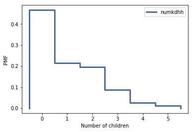
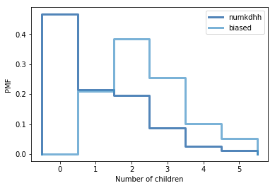
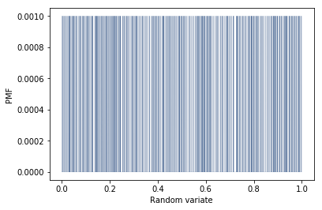
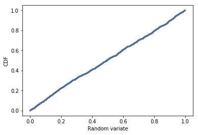

# Statistics

# Table of Contents

[1. Introduction](#section-a)  
[2. Why We Are Using Think Stats](#section-b)  
[3. Instructions for Cloning the Repo](#section-c)  
[4. Required Exercises](#section-d)  
[5. Optional Exercises](#section-e)  
[6. Recommended Reading](#section-f)  
[7. Resources](#section-g)

## <a name="section-a"></a>1.  Introduction

[](http://greenteapress.com/thinkstats2/)

Use Allen Downey's [Think Stats (second edition)](http://greenteapress.com/thinkstats2/) book for getting up to speed with core ideas in statistics and how to approach them programmatically. This book is available online, or you can buy a paper copy if you would like.

Use this book as a reference when answering the 6 required statistics questions below.  The Think Stats book is approximately 200 pages in length.  **It is recommended that you read the entire book, particularly if you are less familiar with introductory statistical concepts.**

Complete the following exercises along with the questions in this file. Some can be solved using code provided with the book. The preface of Think Stats [explains](http://greenteapress.com/thinkstats2/html/thinkstats2001.html#toc2) how to use the code.  

Communicate the problem, how you solved it, and the solution, within each of the following [markdown](https://guides.github.com/features/mastering-markdown/) files. (You can include code blocks and images within markdown.)

## <a name="section-b"></a>2.  Why We Are Using Think Stats 

The stats exercises have been chosen to introduce/solidify some relevant statistical concepts related to data science.  The solutions for these exercises are available in the [ThinkStats repository on GitHub](https://github.com/AllenDowney/ThinkStats2).  You should focus on understanding the statistical concepts, python programming and interpreting the results.  If you are stuck, review the solutions and recode the python in a way that is more understandable to you. 

For example, in the first exercise, the author has already written a function to compute Cohen's D.  **You could import it, or you could write your own code to practice python and develop a deeper understanding of the concept.** 

Think Stats uses a higher degree of python complexity from the python tutorials and introductions to python concepts, and that is intentional to prepare you for the bootcamp.  

**One of the skills to learn here is to understand other people’s code.  And this author is quite experienced, so it’s good to learn how functions and imports work.**

---

## <a name="section-c"></a>3.  Instructions for Cloning the Repo 
Using the [code referenced in the book](https://github.com/AllenDowney/ThinkStats2), follow the step-by-step instructions below.  

**Step 1. Create a directory on your computer where you will do the prework.  Below is an example:**

```
(Mac):      /Users/yourname/ds/metis/metisgh/prework  
(Windows):  C:/ds/metis/metisgh/prework
```

**Step 2. cd into the prework directory.  Use GitHub to pull this repo to your computer.**

```
$ git clone https://github.com/AllenDowney/ThinkStats2.git
```

**Step 3.  Put your ipython notebook or python code files in this directory (that way, it can pull the needed dependencies):**

```
(Mac):     /Users/yourname/ds/metis/metisgh/prework/ThinkStats2/code  
(Windows):  C:/ds/metis/metisgh/prework/ThinkStats2/code
```

---


## <a name="section-d"></a>4.  Required Exercises

*Include your Python code, results and explanation (where applicable).*

### Q1. [Think Stats Chapter 2 Exercise 4](2-4-cohens_d.md) (effect size of Cohen's d)  
Cohen's D is an example of effect size.  Other examples of effect size are:  correlation between two variables, mean difference, regression coefficients and standardized test statistics such as: t, Z, F, etc. In this example, you will compute Cohen's D to quantify (or measure) the difference between two groups of data.   

You will see effect size again and again in results of algorithms that are run in data science.  For instance, in the bootcamp, when you run a regression analysis, you will recognize the t-statistic as an example of effect size.


***Import library***
```
from __future__ import print_function, division
%matplotlib inline
import numpy as np
import nsfg
import first
import thinkstats2
import thinkplot
```

***Load the data from the pregnancy file and select the records for live births.***
```
preg = nsfg.ReadFemPreg()
live = preg[preg.outcome == 1]
```

***From live births, we can selec first babies and others using birthord***
```
firsts = live[live.birthord == 1]
others = live[live.birthord != 1]
```

***This functon computes the Cohen'd effect size, which is the difference in means expressed in number of standard deviations***
```
def CohenEffectSize(group1, group2):
    """Computes Cohen's effect size for two groups.
    
    group1: Series or DataFrame
    group2: Series or DataFrame
    
    returns: float if the arguments are Series;
             Series if the arguments are DataFrames
    """
    diff = group1.mean() - group2.mean()

    var1 = group1.var()
    var2 = group2.var()
    n1, n2 = len(group1), len(group2)

    pooled_var = (n1 * var1 + n2 * var2) / (n1 + n2)
    d = diff / np.sqrt(pooled_var)
    return d
```

***Use the variable totalwgt_lb, investigate whether first babies are lighter or heavier than others.***
```
firsts.totalwgt_lb.mean()
others.totalwgt_lb.mean()
```

- ***The mean total weight for first babies :***```7.201094430437772```
- ***The mean total weight for others :***```7.325855614973262```

***Compute the Cohen’s effect size to quantify the difference in weights between first babies and others.***
```
CohenEffectSize(firsts.totalwgt_lb, others.totalwgt_lb)
```

- ***Cohen’s d to quantify the difference between the groups:*** `-0.08867292707260174`


### Q2. [Think Stats Chapter 3 Exercise 1](3-1-actual_biased.md) (actual vs. biased)
This problem presents a robust example of actual vs biased data.  As a data scientist, it will be important to examine not only the data that is available, but also the data that may be missing but highly relevant.  You will see how the absence of this relevant data will bias a dataset, its distribution, and ultimately, its statistical interpretation.

***Import library***
```
from __future__ import print_function, division
%matplotlib inline
import numpy as np
import nsfg
import first
import thinkstats2
import thinkplot
```

***Load the NSFG respondent dataset***
```
resp = nsfg.ReadFemResp()
```


***Create a Pmf object***
```
pmf = thinkstats2.Pmf(resp.numkdhh, label='numkdhh')
```

***Use the NSFG respondent variable numkdhh to construct the actual distribution for the number of children under 18 in the respondents' households***
```
thinkplot.Pmf(pmf)
thinkplot.Config(xlabel='Number of children', ylabel='PMF')
```


***This function computes the biased PMF.***
```
def BiasPmf(pmf, label):
    new_pmf = pmf.Copy(label=label)
    
    for x, p in pmf.Items():
        new_pmf.Mult(x, x)
        
    new_pmf.Normalize()
    return new_pmf
```


***Compute the biased distribution we would see if we surveyed the children and asked them how many children under 18 (including themselves) are in their household.***
```
biased = BiasPmf(pmf, label='biased')
```


***Plot the actual and biased distributions, and compute their means***
```
thinkplot.PrePlot(2)
thinkplot.Pmfs([pmf, biased])
thinkplot.Config(xlabel='Number of children', ylabel='PMF')
```



***Compute their means***
```
pmf.Mean()
biased.Mean()
```

-  ***the mean of actual distribution :*** `1.024205155043831`

-  ***the mean of biased distribution :*** `2.403679100664282`


### Q3. [Think Stats Chapter 4 Exercise 2](4-2-random_dist.md) (random distribution)  
This questions asks you to examine the function that produces random numbers.  Is it really random?  A good way to test that is to examine the pmf and cdf of the list of random numbers and visualize the distribution.  If you're not sure what pmf is, read more about it in Chapter 3.  


***Import library***
```
from __future__ import print_function, division
%matplotlib inline
import numpy as np
import nsfg
import first
import thinkstats2
import thinkplot
```


***Generate 1000 numbers from random.random  (uniform between 0 and 1)***
```
rdn_num = np.random.random(1000)
```


***Plot the PMF. The distribution uniform***
```
pmf = thinkstats2.Pmf(rdn_num , label='random_number')
thinkplot.Pmf(pmf)
thinkplot.Config(xlabel='Random variate', ylabel='PMF')
```



***Plot the CDF. The distribution uniform***

```
cdf = thinkstats2.Cdf(rdn_num)
thinkplot.Cdf(cdf)
thinkplot.Config(xlabel='Random variate', ylabel='CDF')
```




### Q4. [Think Stats Chapter 5 Exercise 1](5-1-blue_men.md) (normal distribution of blue men)
This is a classic example of hypothesis testing using the normal distribution.  The effect size used here is the Z-statistic. 


***Import library***
```
from __future__ import print_function, division
%matplotlib inline
import numpy as np
scipy.stats as stats
```

***Create normal distribution***
```
mu = 178
sigma = 7.7
dist = scipy.stats.norm(loc=mu, scale=sigma)
print(type(dist))
print('the mean is {} and standard deviation is {}'.format(dist.mean(), dist.std()))
```


***Convert feet to centimeter:*** `cm = feet/0.0328 + inch/0.3937`
```
# 5'10"
f1 = 5
i1 = 10
cm1 = f1/0.0328 + i1/0.3937

# 6'1"
f2 = 6
i2 = 1
cm2 = f2/0.0328 + i2/0.3937

cm1, cm2
```

`>> 177.8390751903455, 185.46683434830283`

***It can also evaluate its CDF. How many people are below the 5'10" and 6'1"***
```
low = dist.cdf(cm1)
high = dist.cdf(cm2)
range_height = high - low
high, low , range_height
```

`>> 0.48963902786483265, 0.8317337108107857, 0.3420946829459531`

- ***The percentage of the U.S. male population is below  5'10":*** `48.96%`
- ***The percentage of the U.S. male population is below 6'1":*** `83.17%`


- ***The percentage of the U.S. male population is in this range 5'10" and 6'1":*** `34.2%`


### Q5. Bayesian (Elvis Presley twin) 

Bayes' Theorem is an important tool in understanding what we really know, given evidence of other information we have, in a quantitative way.  It helps incorporate conditional probabilities into our conclusions.

Elvis Presley had a twin brother who died at birth.  What is the probability that Elvis was an identical twin? Assume we observe the following probabilities in the population: fraternal twin is 1/125 and identical twin is 1/300.  


- In 3000 births, we have `3000 * (1/300) = 10` sets of identical twins. Half of those would be girls (girl-girl twin), other half would be boys (boy-boy twin). So we have `5` sets of boy-boy identical twins 

- In 3000 births, we have `3000 * (1/125) = 24` sets of fraternal twins. 1/4 would be girl-girl, 1/4 would be girl-boy, 1/4 would be boy-girl and 1/4 would be boy-boy. So we have `24 * (1/4) = 6` sets of boy-boy fraternal twins.

- Therefore, out of 3000 births, `5 out of 11` sets of boy-boy twins would be identical. So the probability Elvis was an identical twin is `5/11`


***Calculate the unconditional probabilities***

```math
P[identical twins & brother twin] = P[identical twins] * P[brother twin | identical twins] = 1/300 * 1/2 
```

```math
P[fraternal twins & brother twin] = P[fraternal twins] * P[brother twin | identical twins] = 1/125 * 1/4
```

```math
P[brother twin] = P[identical twins & brother twin]  +  P[fraternal twins & brother twin] = 1/600 + 1/500
```

```math
P[identical twins | brother twin] = P[identical twins & brother twin] / P[brother twin] = (1/600) / ( 1/600 + 1/500) = 5/11
```


---

### Q6. Bayesian &amp; Frequentist Comparison  
How do frequentist and Bayesian statistics compare?


Bayesian | Frequentist
------------ | -------------
uses probability for both hypotheses `H` and data `D` (prior `P(H)` and posterior `P(H \mid D)` | never uses the probability of a hypothesis
depends on the prior and likelihood of observed data | depends on the likelihood ```$P(D \given H)``` for both observed and unobserved data
requires  one to know or construct a 'subjective prior' | does not require a prior
may be computationally intensive due to integration over many parameters  | tends to less computationally intensive
choice of the data model + prior distribution + objectivity + data + endless argument about one thing | choice of the data model + sample space and how repetitions of the experiment are envisioned, choice of stop rule. 1-tailed vs 2-tailed tests, multiplicity adjustments + objectivity + data + endless argument about everything

---

## <a name="section-e"></a>5.  Optional Exercises

The following exercises are optional, but we highly encourage you to complete them if you have the time.

### Q7. [Think Stats Chapter 7 Exercise 1](7-1-weight_vs_age.md) (correlation of weight vs. age)
In this exercise, you will compute the effect size of correlation.  Correlation measures the relationship of two variables, and data science is about exploring relationships in data.    

### Q8. [Think Stats Chapter 8 Exercise 2](8-2-sampling_dist.md) (sampling distribution)
In the theoretical world, all data related to an experiment or a scientific problem would be available.  In the real world, some subset of that data is available.  This exercise asks you to take samples from an exponential distribution and examine how the standard error and confidence intervals vary with the sample size.

### Q9. [Think Stats Chapter 6 Exercise 1](6-1-household_income.md) (skewness of household income)
### Q10. [Think Stats Chapter 8 Exercise 3](8-3-scoring.md) (scoring)
### Q11. [Think Stats Chapter 9 Exercise 2](9-2-resampling.md) (resampling)

---

## <a name="section-f"></a>6.  Recommended Reading

Read Allen Downey's [Think Bayes](http://greenteapress.com/thinkbayes/) book.  It is available online for free, or you can buy a paper copy if you would like.

[](http://greenteapress.com/thinkbayes/) 

---

## <a name="section-g"></a>7.  More Resources

Some people enjoy video content such as Khan Academy's [Probability and Statistics](https://www.khanacademy.org/math/probability) or the much longer and more in-depth Harvard [Statistics 110](https://www.youtube.com/playlist?list=PL2SOU6wwxB0uwwH80KTQ6ht66KWxbzTIo). You might also be interested in the book [Statistics Done Wrong](http://www.statisticsdonewrong.com/) or a very short [overview](http://schoolofdata.org/handbook/courses/the-math-you-need-to-start/) from School of Data.
